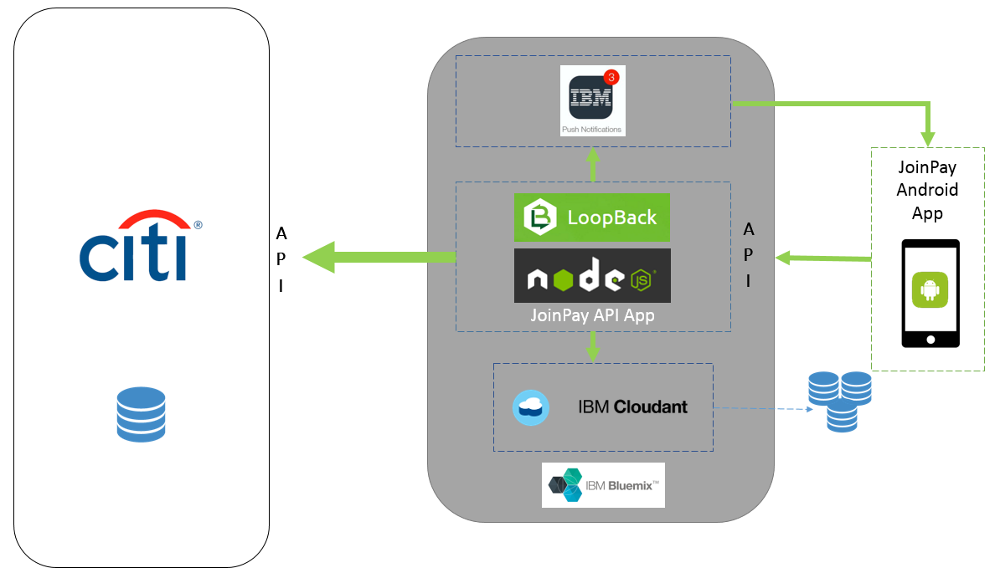
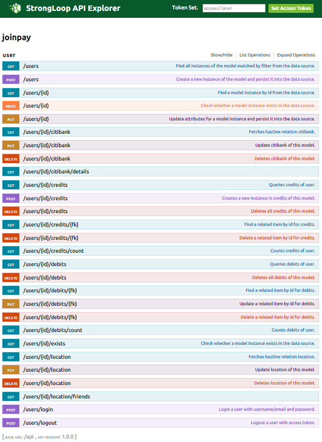
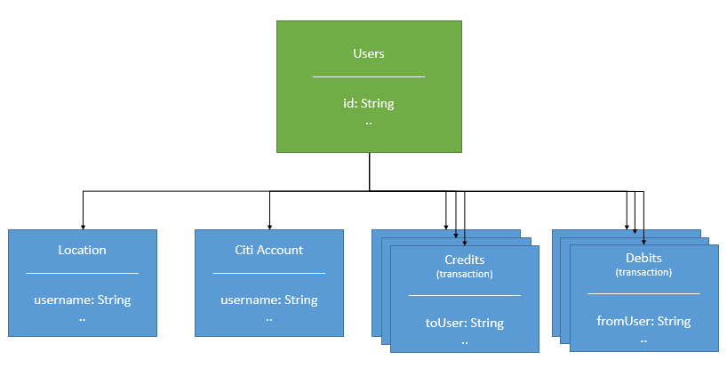
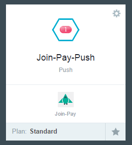

---
#JoinPay Write Up
---

##Introduction
This article outlines a common scenario in the modern application development marketplace:
_How do we create a scalable, secure, and cloud-ready application?_
Oh, and by the way, this application needs to be finished yesterday.
Today, we're going to talk about our own experience and outcome with an Android application called JoinPay.
In a short period of time we took JoinPay from a UI mockup to a production ready Android app that includes scalability and security.
We were able to do this by using the plethora of services and applications that are built in to <a href="http://bluemix.net">IBM Bluemix</a>.

 

##Where we started
Citibank is taking full advantage of the unique opportunities offered in the world of cloud development by crowd-sourcing their technology innovations.
They have staged a hackathon called the <a href="http://www.citimobilechallenge.com/index.php">Citi Mobile Challenge</a>,
in which they gave developers access to a set of mocked-up APIs that allowed programmatic access to Citi's banking services.
They also encourage use of their [API Partners](http://www.citimobilechallenge.com/apis/).
Developers compete to produce the most innovative mobile app using these APIs.
JoinPay started its life as the winner of the 2014 Citi Mobile Challenge.
The idea behind JoinPay was to allow Citi account holders to split a bill at a restaurant by authorizing transfers between Citi accounts using their mobile devices.
The JoinPay app had a fantastic UI for demonstrating this story, but JoinPay's authors were rightfully focused on the story, rather than designing and implementing the app with scalability, performance, and security.
This is the point where we, IBM, stepped in.

###What we needed
The features we needed JoinPay to deliver can be summarized as the following:
1. A mobile backend that can scale and is secure
2. Persistent database store
3. Generate and receive Push Notifications
4. Find nearby users
5. Interaction with Citi APIs
6. Completed as soon as possible

##Architecture
This type of architecture boils down to what has been dubbed "Two speed IT".
In two speed IT a large cog (Citi) is powering a smaller faster cog (JoinPay).
The two companies intersect via APIs to deliver a compelling product.
In our specific case the large cog will expose restful APIs which JoinPay will leverage to implement their bill splitting application.
The small cog is able to iterate quickly and focus on specific functionality.
Their quick speed is in part due to their small size (employee wise), but also their focused scope of a UI driven product.
The large cog is able to concentrate on the slower moving parts such as DB compliance, availability and privacy.
An architecture that implements the features we need is in the figure below:

###Two Speed IT

	
##User Story
Let’s first flush out the particular user story we want to fulfill:

A user, let's call him Bob, goes out for dinner with some friends including Alice.
Bob picks up the tab and now wants to receive payment from Alice.
JoinPay allows Bob to select users that are nearby which includes Alice.
He can then type the total and split the bill among his selected friends.
The recipients are then notified of pending transactions via push notifications, and can approve or deny the transaction.
When a transaction is approved JoinPay will use the Citi APIs to make the money transfer.

##How we built it
The first step to making the JoinPay story a reality was to implement a backend.
A "backend" in this case was a collection of REST APIs and an accompanying database.
This allows the data provided by the instance of JoinPay on Bob's phone to be utilized by the instance running on Alice's phone.
Specifically, part of the story is to identify when Alice and Bob have sat down together at a restaurant. 
Android's APIs allow for the collection of the geocordinates, but for the instance on Bob's phone to know that Alice is nearby, Alice's
instance must report her position, and Bob's instance must be able to retrieve this information.
 
 
At this point, you may be thinking: "But why does this involve using an API? Couldn't I just have each app instance connect to a shared database in the cloud?" 
You could.
However, this design choice reveals an unreasonable amount of information about each user to the other users.
For example, why does Alice need to know Bob's location?  She really just needs to know if he's nearby.
The API can provide this safer level of abstraction.
 
 

##Enter LoopBack
  

Creating APIs in Node.js is simple enough, but a framework such as [LoopBack](http://loopback.io/) can make it even faster and more organized.
LoopBack uses a model driven approach to generate APIs (runnable node.js code) and even [Swagger](http://swagger.io/) (REST API documentation).
LoopBack is a great fit for this project since we can describe all entities of the project with data models.
Models are descriptions/schemas of the data objects your system will contain.  Our project will have the following models:
###Models
1. Users
2. Transactions
3. Locations
4. Citi Accounts

LoopBack has a simple CLI wizard, called slc, to help generate the models. 
Before we create models we should create the base project.

	> npm install -g strongloop
	> slc loopback
	
	[?] Enter a directory name where to create the project: joinpay
	[?] What's the name of your application? joinpay
	
Now we can create our first model "user".
We will take advantage of the base model "User" which will give us many fields such as:

- username
- password
- email
- emailVerified
- verificationToken
- status
- created
- lastUpdated

The base "User" model also give us powerful [permissions/roles](https://docs.strongloop.com/display/public/LB/Controlling+data+access) to help restrict access to the model and even fields.
We will explore these later.

Let’s create the model now. The only field we need to add is a field to contain the URL of a profile image.
	
	> cd joinpay
	> slc loopback:model
	
	[?] Enter the model name: user
	[?] Select the data-source to attach person to: db (memory)
	[?] Select the model's base class
	> User
	[?] Expose person via the REST API? Yes
	[?] Custom plural form (used to build REST URL): users
	Let's add some person properties now.
	
	Enter an empty property name when done.
	[?] Property name: img
	[?] Property type:
	> string
	[?] Required? (y/N) y

That’s it.
You can view/edit the generate files in "joinpay\common\models".
We can start the app and view the StrongLoop API Explorer to see the generated [swagger](http://swagger.io/) and even test the REST API calls for "users".

	> node ./	
If you used default config settings it will be expose on [http://localhost:3000/explorer/](http://localhost:3000/explorer/)

 

## JoinPay Swagger
Now lets fast forward and show you what we created for JoinPay.

The swagger above shows the CRUD for each of the models we needed exposed.
I'd recommend viewing our models in our repo at "joinpay\common\models" to see the modifications we made to the generated files.

 

##Model Relations
Setting up a relation is helpful because it will generate the corresponding REST API methods.
For example "user" has a "hasOne" relation with "location".
With this setup LoopBack will create CRUD endpoints for /users/{id}/location.

LoopBack allows you to [relate models](https://docs.strongloop.com/display/public/LB/Creating+model+relations) by creating an entry in the "relations" field of the parent.
Below is a subset of our user.json file for our "users" model.
In it you will see 4 entries which represent our models.
Each of the relations follow this format:

	"DESIRED_REST_NAME": {
							"type": "hasMany OR hasOne, OR belongsTo OR hasManyThrough",
							"model": "MODEL_NAME",
							"foreignKey": "NAME_OF_FIELD_FOUND_IN_MODEL_NAME"
						}
The "foreignKey" field should be the name of the field that exist in the child model that relates to the parent.
For example our User's ID field will exist in the Location's username field.
FYI LoopBack supports other more complicated relations with the [HasManyThrough](https://docs.strongloop.com/display/public/LB/HasManyThrough+relations) key type.

Abbreviated /joinpay/common/user.json :

	{
		"name": "user",
		"plural": "users",
		"base": "User",
		"idInjection": true,
		"properties": {
			...
		},
		"validations": [],
		"relations": {
			"credits": {
				"type": "hasMany",
				"model": "transaction",
				"foreignKey": "toUser"
			},
			"debits": {
				"type": "hasMany",
				"model": "transaction",
				"foreignKey": "fromUser"
			},
			"location": {
				"type": "hasOne",
				"model": "location",
				"foreignKey": "username"
			},
			"citibank": {
				"type": "hasOne",
				"model": "citibank",
				"foreignKey": "username"
			}
		},
		"acls": [
			{
			"principalType": "ROLE",
			"principalId": "$owner",
			"permission": "ALLOW",
			"property": "__create__credits"
			},
			{
			"principalType": "ROLE",
			"principalId": "$owner",
			"permission": "ALLOW",
			"property": "__get__credits"
			},
			{
			"principalType": "ROLE",
			"principalId": "$owner",
			"permission": "ALLOW",
			"property": "__findById__credits"
			},
			{
			"principalType": "ROLE",
			"principalId": "$owner",
			"permission": "ALLOW",
			"property": "__updateById__credits"
			}
			...
		],
		"methods": {}
	}
One thing that should stand out is that we cosmetically renamed the transaction model to "credits" and "debits".
This allows us to use LoopBack's built in CRUD generation to get transactions from either perspective.
If we only had one model the generated CRUD APIs will only allow us to look up transactions from either the "fromUser" or "toUser field.

###Authentication and Permissions
One of the greatest features of LoopBack is its built in user authentication and permission system.
Since we choose "User" as a base class for "users" we already have log in and restrictive access features.
Also note that all of our models are related to the "user" model.
Therefore access to each model can also be protected.
LoopBack has a really granular level of permissions.
I recommend reading their documentation on permissions before attempting to manipulate them.
- [LoopBack Permissions](https://docs.strongloop.com/display/public/LB/Authentication%2C+authorization%2C+and+permissions)

In our abbreviated example above you can see we have allowed the "$owner" to create/edit/find/update "credits".
Also note that the base model "User" has its own set of "acls" that can be found in LoopBack's core module.
- \joinpay\node_modules\loopback\common\models\user.json

####Login
The login endpoint accepts the following body:

	{
		"username": "bob",
		"password": "password"	
	}
	
If successful it will then return with an access_token. 
This is a model that is related to the base "User" class.
The access_token's ID should be provided in an Authorization header like so:

	Authorization: ACCESS_TOKEN
	
Any API endpoints that are protected with $authorized or $owner will need this header.
In JoinPay almost everything is protected at the $owner level.

###Datasources
Something you may notice is we changed the data source of our models to "cloudant" from "db (memory)".
[Cloudant](https://cloudant.com/) is couchDB based, which is not supported natively by LoopBack.
You will need to install the connector [loopback-connector-couch](https://www.npmjs.com/package/loopback-connector-couch).
Then you should add an entry to your datasources.json file like below:

/joinpay/server/datasources.json

	{
		"db": {
			"name": "db",
			"connector": "memory"
		},
		"cloudant": {
			"host": "YOUR-INSTANCE-bluemix.cloudant.com",
			"port": 443,
			"name": "cloudant",
			"connector": "couch",
			"db": "records",
			"protocol": "https",
			"auth": {
			"admin": {
				"username": "YOUR-INSTANCE-USER",
				"password": "YOUR-INSTANCE-PASSWORD"
			},
			"reader": {
				"username": "YOUR-INSTANCE-USER",
				"password": "YOUR-INSTANCE-PASSWORD"
			},
			"writer": {
				"username": "YOUR-INSTANCE-USER",
				"password": "YOUR-INSTANCE-PASSWORD"
			}
			},
			"views": [
			{
				"ddoc": "_design/all",
				"name": "new-view"
			}
			]
		}
	}
	
Now if you change the model's entry in /joinpay/server/model-config.json from "db" to "cloudant" it will search Cloudant for the data object.

 

##Bluemix
Now that we have the project working locally we need to choose how to host it.
We chose to host our <a href="https://nodejs.org/">Node.js</a> code with <a href="http://bluemix.net">Bluemix</a>.
<a href="http://bluemix.net">Bluemix</a> is a IBM's PaaS Solution that allows us to host our running Node.js code without us having to setup a host machine/VM.
The <a href="https://github.com/cloudfoundry/nodejs-buildpack">Node.js buildpack</a> allowed us to simply push our Node.js code along with a package.json file and end up with a running API in the cloud.
<a href="http://bluemix.net">Bluemix</a> also enables our app to scale at the literal push of a button.
By simply increasing the number of app instances it will deploy a load-balanced environment to meet our user demand.
Not only that, but when it comes to databases selection we have several options that are already integrated in <a href="http://bluemix.net">Bluemix</a>.

 

##IBM Push

Let's examine how we implemented Push Notifications.
Luckily enough <a href="http://bluemix.net">Bluemix</a> has a registered service just for this: <a href="https://www.ng.bluemix.net/docs/#services/push/index.html#gettingstarted">Push Service</a>.

Great, so once we add the tile we can configure it to work with our Google Developer Account (it can also do iOS if you're into that kind of thing).
If you open the Push tile there will be a link to starter code that shows how to integrate the reception of a Push Notification.

As a bonus there is an ability to manage/test push notifications in the dashboard of this tile.
From here we can send push to specific devices, device users, device categories, or to topics (devices can subscribe to topics in their native code).

On the initiating side of things we have a JS function to trigger the push notification seen below.

Push Notification Code:

	//send push notification with IBM push service
	module.exports.send_push_notification = function (username, msg, cb){
		console.log('send_push_notification() - fired:', username, ":", msg);
		var options = 	{
							host: "mobile.ng.bluemix.net",
							path: "push/v1/apps/3fdaeee4-d711-4ffe-9681-6afee65a120a/messages",
							headers: {
								'Content-Type': 'application/json',
								'IBM-Application-Secret': '8c55c943843f34c14672d6f36cfe4fe3f6961d1d'
							}
						};
		var body = {
						"message": {
										"alert": msg
									},
						"target": {
									"consumerIds":[ {"consumerId": username }]
						}
					};
		options.success = function(statusCode, data){
			console.log("POST Push - success", data);
			if(cb) cb(null, data);
		};
		options.failure = function(statusCode, e){
			console.log("POST Push - failure", e);
			if(cb) cb(statusCode, e);
		};
		rest.post(options, '', body);
	};

It's simply another RESTFUL endpoint. 
It's actually a rather straightforward REST call using Node.js's "request" module.
First an "options" object is set up that contains critical fields for describing the HTTP request such as "host", "path", and 'headers".
The payload of the request is setup in the "body" variable.

 

##Location
Next on our list is to find nearby users.
This is implemented in our Node.js APIs with two endpoints:
- PUT /users/{id}/location
	- This api expects the location to be in the body of the message.  Formatted as JSON with the fields "latitude" and "longitude".
- GET /users/{id}/locatioin/friends
	- It will respond with a JSON payload containing an array of usernames and their distances to the requester's location.
	- This is a non-CRUD API and requies uses LoopBack's [Remote Method](https://docs.strongloop.com/display/public/LB/Remote+methods)
	- Our code for the remote method can be found in /joinpay/models/common/user.js

Some basic Android code is needed to periodically talk to the device's GPS and receive latitude and longitude coordinates. 
Then its just a matter of invoking the API to update the user's location, and periodically call GET /nearby/users to update the user map.

 

##Money
Nearly there now.  This may be the most important part of the whole application. 
It's time to interact with Citi Bank's APIs to move money!
Unfortunately they do not exist in a usable form for this application.
This may seem like a major deal-breaker, but's actually quite common of a problem.
By leveraging a rapid development model, you may often find yourself ahead of the development of other projects that yours depends on.
Waiting is one option, but that's boring.

When the road runs out our group's preference is to start building the road our self.
Therefore we spin up another Node.js app, and start writing our own implementation of the Citi Bank APIs.
Obviously we do not have real money to move around, so from a money perspective these APIs are fake.
In every other regard these APIs are very real.  They know about users, accounts, balances, transactions, and security elements (authorization).
Ideally we built these APIs as close to the real thing as possible, such that flipping to the real ones involves only changing the endpoint's URL.
After all from JoinPay's perspective the Citi APIs are just a black box.

 

##Final Words
Development at lightning speed can have its pitfalls and limitations, but if you plan accordingly and leverage tool sets such as those found in <a href="http://bluemix.net">Bluemix</a> its quite possible.
The end result of our endeavor is quite positive.
If we did this again we would like to use some of the other services found in the Bluemix catalog such as the debugging service for mobile apps: 
<a href="https://mqedg.mybluemix.net/MQEHelp.jsp#">Mobile Quality Extension</a>.
Citi also has many [API partners](http://www.citimobilechallenge.com/apis/) such as [Uber](https://uber.com).
Our [Uber tutorial](./uber.md) can show you how to get started with their transportation network.

The time saving efforts were largely possible with <a href="http://bluemix.net">Bluemix</a> because:

1. We never had to configure a host machine to run our code.
2. We never have to figure out how to load balance our code instances.
3. We got starter code to hit the ground running for our Node.js apps and Push Notification
4. We never had to hardcode/protect our database credentials
5. We never had to build a monitoring service to keep our service up should it crash

